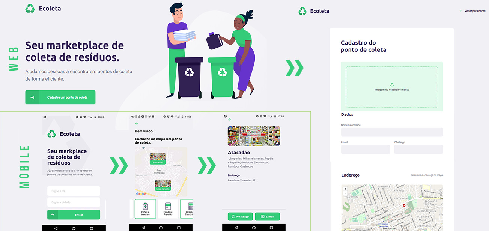
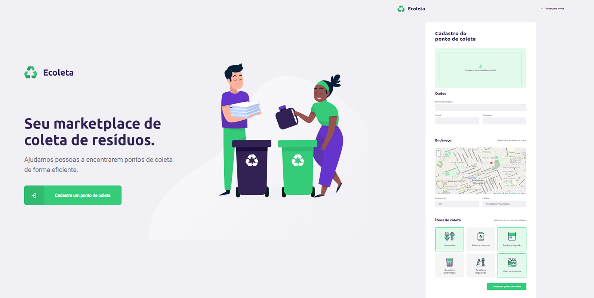
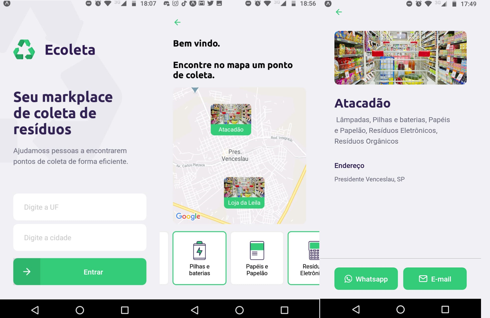

<h1 align="center">
  Ecoleta
<br />  
  <br /> 
  
<br />
</h1>
 <p align="center"> <strong> Marketplace de coleta de resíduos desenvolvido durante a Next Level Week </strong> </p>

<p align="center">
  <a href="https://opensource.org/licenses/MIT">
    
  </a>
</p>

##  :notebook_with_decorative_cover: Sobre
A Next Level Week foi realizado pela Rocketseat com o propósito de criar uma aplicação do zero durante a semana do meio ambiente.
<br />
Este evento teve como foco desenvolver a aplicação Ecoleta, um marketplace de coleta de resíduos que tem como finalidade cadastrar e exibir pontos de coleta mais próximos do usuário.
-  **Server** : Objetivo de garantir a conexão entre os componentes da aplicação e o banco de dados;
-  **Web** : Interface desenvolvida de pontos de coleta;
-  **Mobile** : Aplicativo que exibe todos os pontos de coleta próximos a localização do usuário.

##  :computer: Tecnologias utilizadas
- ⚛️ **React Js** — Uma biblioteca JavaScript para criar interfaces de usuário
- ⚛️ **React Native** — Uma biblioteca que fornece uma maneira de criar aplicativos nativos para Android e iOS
- 💹 **Node Js** — Uma estrutura da web para back-end

## :rocket: Layout
- **WEB** 


- **Mobile** 



## IMPORTANTE:
Baixe todas as dependências utilizadas antes da execução da aplicação
<br />
```npm install ``` : para a instalação das dependências
<br />
```npm start ``` : executa a aplicação WEB e Mobile
<br />
```npm run dev ``` : executa o node.js

